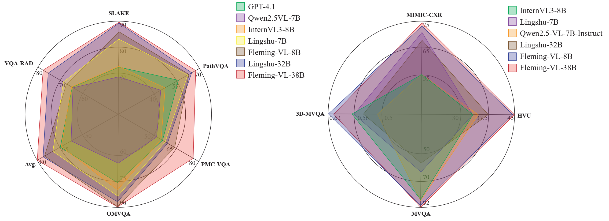
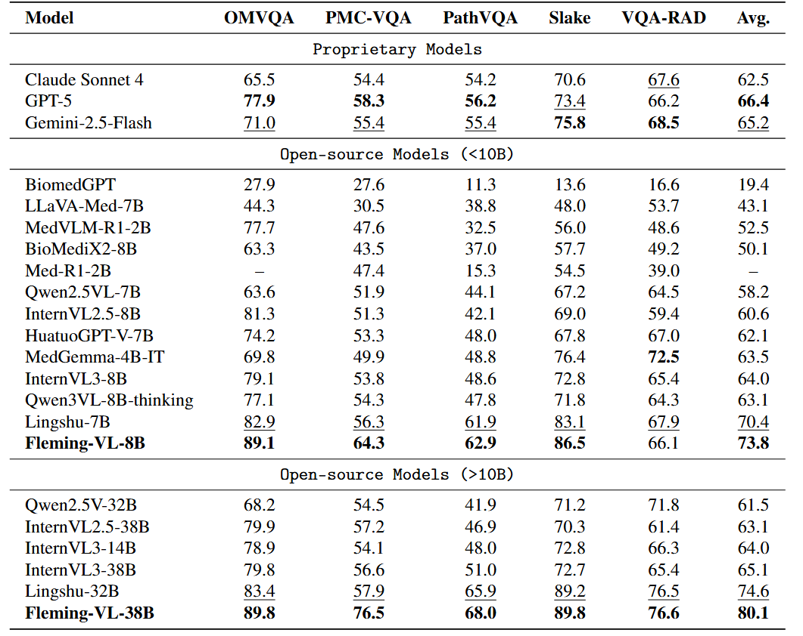
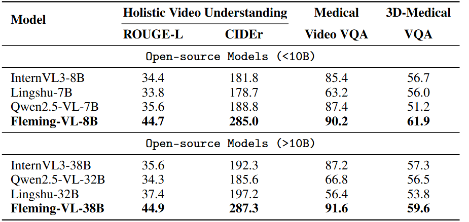
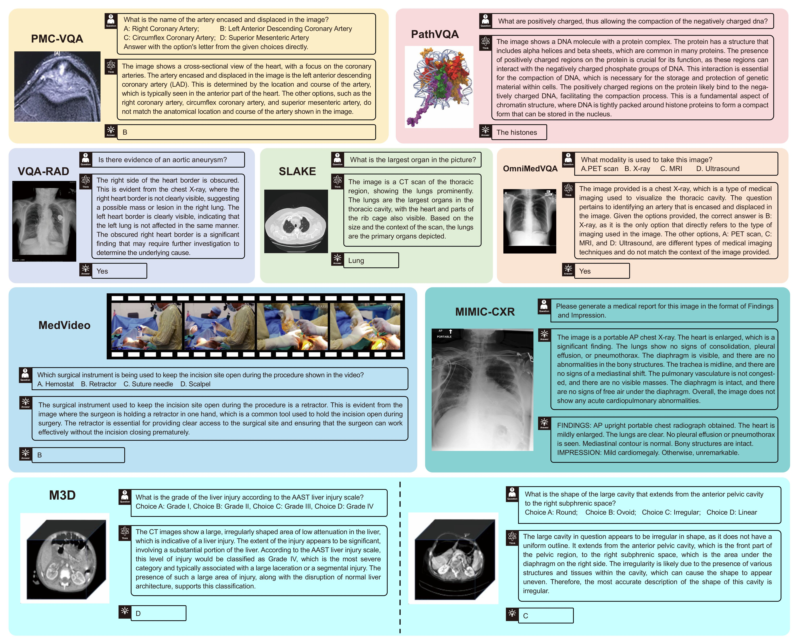

# Fleming-VL

<p align="center">
    🌐 <a href="" target="_blank">博客</a> | 📃 <a href="" target="_blank">论文</a> | 🤗 <a href="https://huggingface.co/UbiquantAI/Fleming-VL-8B" target="_blank">模型</a> |  🤗 <a href="" target="_blank">训练数据</a>  |  🎥 <a href="" target="_blank">演示</a>

</p>


## 📖 模型概述

Fleming-VL 是一个面向医疗场景的多模态推理模型，能够处理和分析各种类型的医疗数据，包括2D图像、3D体积数据和视频序列。该模型对复杂的多模态医疗问题进行逐步分析，并产生可靠的答案。基于 GRPO 推理范式，Fleming-VL 扩展了处理多样化医学影像模态的能力，同时保持强大的推理性能。

**模型特点：**

* **多模态处理** 支持各种医疗数据类型，包括2D图像（X光片、病理切片）、3D体积（CT/MRI扫描）和视频（超声、内窥镜、手术记录）；
* **医学推理** 执行逐步的思维链推理来分析复杂的医学问题，结合视觉信息和医学知识提供可靠的诊断见解。

## 📦 发布版本

- **Fleming-VL-7B** —— 基于 InternVL3-8B 训练  
  🤗 [`UbiquantAI/Fleming-VL-8B`](https://huggingface.co/UbiquantAI/Fleming-VL-8B)
- **Fleming-VL-38B** —— 基于 InternVL3-38B 训练   
  🤗 [`UbiquantAI/Fleming-VL-8B`](https://huggingface.co/UbiquantAI/Fleming-VL-38B)

## 📊 性能表现

<div align="center">
  <figure>
    
    <figcaption><b>图 1.</b> 主要基准测试结果。</figcaption>
  </figure>
</div>

<div align="center">
  <figure>
    
    <figcaption><b>图 2.</b> 通用医学 VQA。</figcaption>
  </figure>
</div>

<div align="center">
  <figure>
    
    <figcaption><b>图 3.</b> 医学报告生成。</figcaption>
  </figure>
</div>

<div align="center">
  <figure>
    
    <figcaption><b>图 4.</b> 视频和3D理解。</figcaption>
  </figure>
</div>

## 📊 医学多模态任务

<div align="center">
  <figure>
    
    <figcaption><b>跨不同医学多模态任务的推理</b></figcaption>
  </figure>
</div>

<br>

### 🎯 主要医学多模态任务

<div align="center">

| **任务** | **描述** |
|:---|:---|
| 🏥 **疾病诊断** | 整合医学影像与临床记录，实现全面的疾病识别 |
| 🔄 **跨模态分析** | 融合不同影像模态，提升诊断准确性 |
| 📄 **医学报告生成** | 从医学影像自动生成诊断报告 |
| 💊 **治疗反应预测** | 利用多模态数据预测患者对治疗的反应 |
| 💬 **临床问答** | 整合影像与自然语言查询的AI问答系统 |

</div>

## 🔧 快速开始

```python
"""
Fleming-VL-8B Multi-Modal Inference Script

This script demonstrates three inference modes:
1. Single image inference
2. Video inference (frame-by-frame)
3. 3D medical image (CT/MRI) inference from .npy files

Model: UbiquantAI/Fleming-VL-8B
Based on: InternVL_chat-1.2 template
"""

from transformers import AutoTokenizer, AutoModel, CLIPImageProcessor
from decord import VideoReader, cpu
from PIL import Image
import numpy as np
import shutil
import torch
import os


# ============================================================================
# Configuration
# ============================================================================

MODEL_PATH = "UbiquantAI/Fleming-VL-8B"
REQUIRED_FILES_DIR = './required_files'

# Prompt template for reasoning-based responses
REASONING_PROMPT = (
    "A conversation between User and Assistant. The user asks a question, "
    "and the Assistant solves it. The assistant first thinks about the "
    "reasoning process in the mind and then provides the user a concise "
    "final answer in a short word or phrase. The reasoning process and "
    "answer are enclosed within <think> </think> and <answer> </answer> "
    "tags, respectively, i.e., <think> reasoning process here </think>"
    "<answer> answer here </answer>"
)


# ============================================================================
# Utility Functions
# ============================================================================

def copy_necessary_files(target_path, source_path):
    """
    Copy required model configuration files to the model directory.
    
    Args:
        target_path: Destination directory (model path)
        source_path: Source directory containing required files
    """
    required_files = [
        "modeling_internvl_chat.py",
        "conversation.py",
        "modeling_intern_vit.py",
        "preprocessor_config.json",
        "configuration_internvl_chat.py",
        "configuration_intern_vit.py",
    ]
    
    for filename in required_files:
        target_file = os.path.join(target_path, filename)
        source_file = os.path.join(source_path, filename)
        
        if not os.path.exists(target_file):
            print(f"File {filename} not found in target path, copying from source...")
            
            if os.path.exists(source_file):
                try:
                    shutil.copy2(source_file, target_file)
                    print(f"Successfully copied {filename}")
                except Exception as e:
                    print(f"Error copying {filename}: {str(e)}")
            else:
                print(f"Warning: Source file {filename} does not exist, cannot copy")
        else:
            print(f"File {filename} already exists")


def load_model(model_path, use_flash_attn=True):
    """
    Load the vision-language model and tokenizer.
    
    Args:
        model_path: Path to the pretrained model
        use_flash_attn: Whether to use flash attention (default: True)
    
    Returns:
        tuple: (model, tokenizer)
    """
    model = AutoModel.from_pretrained(
        model_path,
        torch_dtype=torch.bfloat16,
        low_cpu_mem_usage=True,
        use_flash_attn=use_flash_attn,
        trust_remote_code=True
    ).eval().cuda()
    
    tokenizer = AutoTokenizer.from_pretrained(
        model_path,
        trust_remote_code=True,
        use_fast=False
    )
    
    return model, tokenizer


# ============================================================================
# Image Inference
# ============================================================================

def inference_single_image(model, tokenizer, image_path, question, prompt=REASONING_PROMPT):
    """
    Perform inference on a single image.
    
    Args:
        model: Loaded vision-language model
        tokenizer: Loaded tokenizer
        image_path: Path to the input image
        question: Question to ask about the image
        prompt: System prompt template
    
    Returns:
        str: Model response
    """
    # Load and preprocess image
    image_processor = CLIPImageProcessor.from_pretrained(MODEL_PATH)
    image = Image.open(image_path).resize((448, 448))
    pixel_values = image_processor(
        images=image,
        return_tensors='pt'
    ).pixel_values.to(torch.bfloat16).cuda()
    
    # Prepare question with prompt and image token
    full_question = f"{prompt}\n<image>\n{question}"
    
    # Generate response
    generation_config = dict(max_new_tokens=1024, do_sample=False)
    response = model.chat(tokenizer, pixel_values, full_question, generation_config)
    
    return response


# ============================================================================
# Video Inference
# ============================================================================

def get_frame_indices(bound, fps, max_frame, first_idx=0, num_segments=32):
    """
    Calculate evenly distributed frame indices for video sampling.
    
    Args:
        bound: Tuple of (start_time, end_time) in seconds, or None for full video
        fps: Frames per second of the video
        max_frame: Maximum frame index
        first_idx: First frame index to consider
        num_segments: Number of frames to sample
    
    Returns:
        np.array: Array of frame indices
    """
    if bound:
        start, end = bound[0], bound[1]
    else:
        start, end = -100000, 100000
    
    start_idx = max(first_idx, round(start * fps))
    end_idx = min(round(end * fps), max_frame)
    seg_size = float(end_idx - start_idx) / num_segments
    
    frame_indices = np.array([
        int(start_idx + (seg_size / 2) + np.round(seg_size * idx))
        for idx in range(num_segments)
    ])
    
    return frame_indices


def load_video(video_path, model_path, bound=None, num_segments=32):
    """
    Load frames from a video file.
    
    Args:
        video_path: Path to the video file
        model_path: Path to the model (for image processor)
        bound: Optional time bounds (start, end) in seconds
        num_segments: Number of frames to extract (default: 32)
    
    Returns:
        tuple: (pixel_values tensor, num_patches_list) or None if error
    """
    try:
        video_reader = VideoReader(video_path, num_threads=1, ctx=cpu(0))
        max_frame = len(video_reader) - 1
        fps = float(video_reader.get_avg_fps())
        
        # Get frame indices to sample
        frame_indices = get_frame_indices(bound, fps, max_frame, first_idx=0, num_segments=num_segments)
        
        image_processor = CLIPImageProcessor.from_pretrained(model_path)
        pixel_values_list = []
        num_patches_list = []
        
        # Process each frame
        for frame_index in frame_indices:
            img = Image.fromarray(video_reader[frame_index].asnumpy()).convert('RGB')
            pixel_values = image_processor(images=img, return_tensors='pt').pixel_values
            num_patches_list.append(pixel_values.shape[0])
            pixel_values_list.append(pixel_values)
        
        pixel_values = torch.cat(pixel_values_list)
        return pixel_values, num_patches_list
    
    except Exception as e:
        print(f"Error processing video: {str(e)}")
        return None


def inference_video(model, tokenizer, video_path, video_duration, question, prompt=REASONING_PROMPT):
    """
    Perform inference on a video.
    
    Args:
        model: Loaded vision-language model
        tokenizer: Loaded tokenizer
        video_path: Path to the video file
        video_duration: Duration of video in seconds
        question: Question to ask about the video
        prompt: System prompt template
    
    Returns:
        str: Model response or None if error
    """
    # Load video frames
    result = load_video(video_path, MODEL_PATH, bound=(0, video_duration))
    
    if result is None:
        return None
    
    pixel_values, num_patches_list = result
    pixel_values = pixel_values.to(torch.bfloat16).cuda()
    
    # Create image token prefix for all frames
    image_prefix = ''.join([f'<image>\n' for _ in range(len(num_patches_list))])
    
    # Prepare question with prompt and image tokens
    full_question = f"{prompt}\n{image_prefix}{question}"
    
    # Generate response
    generation_config = dict(max_new_tokens=1024, do_sample=False)
    response, history = model.chat(
        tokenizer,
        pixel_values,
        full_question,
        generation_config,
        num_patches_list=num_patches_list,
        history=None,
        return_history=True
    )
    
    return response


# ============================================================================
# 3D Medical Image Inference
# ============================================================================

def normalize_image(image):
    """
    Normalize image array to 0-255 range.
    
    Args:
        image: NumPy array of image data
    
    Returns:
        np.array: Normalized image as uint8
    """
    img_min = np.min(image)
    img_max = np.max(image)
    
    if img_max - img_min == 0:
        return np.zeros_like(image, dtype=np.uint8)
    
    return ((image - img_min) / (img_max - img_min) * 255).astype(np.uint8)


def convert_npy_to_images(npy_path, model_path, num_slices=11):
    """
    Convert 3D medical image (.npy) to multiple 2D RGB images.
    
    Expected input shape: (32, 256, 256) or (1, 32, 256, 256)
    Extracts evenly distributed slices and converts to RGB format.
    
    Args:
        npy_path: Path to the .npy file
        model_path: Path to the model (for image processor)
        num_slices: Number of slices to extract (default: 11)
    
    Returns:
        tuple: (pixel_values tensor, list of num_patches per slice) or False if error
    """
    try:
        # Load .npy file
        data = np.load(npy_path)
        
        # Handle shape (1, 32, 256, 256) -> (32, 256, 256)
        if data.ndim == 4 and data.shape[0] == 1:
            data = data[0]
        
        # Validate shape
        if data.shape != (32, 256, 256):
            print(f"Warning: {npy_path} has shape {data.shape}, expected (32, 256, 256), skipping")
            return False
        
        # Select evenly distributed slices from 32 slices
        indices = np.linspace(0, 31, num_slices, dtype=int)
        
        image_processor = CLIPImageProcessor.from_pretrained(model_path)
        pixel_values_list = []
        num_patches_list = []
        
        # Process each selected slice
        for idx in indices:
            # Get slice
            slice_img = data[idx]
            
            # Normalize to 0-255
            normalized = normalize_image(slice_img)
            
            # Convert grayscale to RGB by stacking
            rgb_img = np.stack([normalized, normalized, normalized], axis=-1)
            
            # Convert to PIL Image
            img = Image.fromarray(rgb_img)
            
            # Preprocess with CLIP processor
            pixel_values = image_processor(images=img, return_tensors='pt').pixel_values
            num_patches_list.append(pixel_values.shape[0])
            pixel_values_list.append(pixel_values)
        
        pixel_values = torch.cat(pixel_values_list)
        return pixel_values, num_patches_list
    
    except Exception as e:
        print(f"Error processing {npy_path}: {str(e)}")
        return False


def inference_3d_medical_image(model, tokenizer, npy_path, question, prompt=REASONING_PROMPT):
    """
    Perform inference on 3D medical images stored as .npy files.
    
    Args:
        model: Loaded vision-language model
        tokenizer: Loaded tokenizer
        npy_path: Path to the .npy file (shape: 32x256x256)
        question: Question to ask about the image
        prompt: System prompt template
    
    Returns:
        str: Model response or None if error
    """
    # Convert 3D volume to multiple 2D slices
    result = convert_npy_to_images(npy_path, MODEL_PATH)
    
    if result is False:
        return None
    
    pixel_values, num_patches_list = result
    pixel_values = pixel_values.to(torch.bfloat16).cuda()
    
    # Create image token prefix for all slices
    image_prefix = ''.join([f'<image>\n' for _ in range(len(num_patches_list))])
    
    # Prepare question with prompt and image tokens
    full_question = f"{prompt}\n{image_prefix}{question}"
    
    # Generate response
    generation_config = dict(max_new_tokens=1024, do_sample=False)
    response, history = model.chat(
        tokenizer,
        pixel_values,
        full_question,
        generation_config,
        num_patches_list=num_patches_list,
        history=None,
        return_history=True
    )
    
    return response


# ============================================================================
# Main Execution Examples
# ============================================================================

def main():
    """
    Main function demonstrating all three inference modes.
    """
    # Copy necessary files
    copy_necessary_files(MODEL_PATH, REQUIRED_FILES_DIR)
    
    # ========================================================================
    # Example 1: Single Image Inference
    # ========================================================================
    print("\n" + "="*80)
    print("EXAMPLE 1: Single Image Inference")
    print("="*80)
    
    image_path = "demo/resource/test.png"
    question = (
        "What imaging technique was employed to obtain this picture?\n"
        "A. PET scan. B. CT scan. C. Blood test. D. Fundus imaging."
    )
    
    model, tokenizer = load_model(MODEL_PATH, use_flash_attn=True)
    response = inference_single_image(model, tokenizer, image_path, question)
    
    print(f"\nUser: {question}")
    print(f"Assistant: {response}")
    
    # Clean up GPU memory
    del model, tokenizer
    torch.cuda.empty_cache()
    
    # ========================================================================
    # Example 2: Video Inference
    # ========================================================================
    print("\n" + "="*80)
    print("EXAMPLE 2: Video Inference")
    print("="*80)
    
    video_path = "demo/resource/test.mp4"
    video_duration = 6  # seconds
    question = "Please describe the video."
    
    model, tokenizer = load_model(MODEL_PATH, use_flash_attn=False)
    response = inference_video(model, tokenizer, video_path, video_duration, question)
    
    print(f"\nUser: {question}")
    print(f"Assistant: {response}")
    
    # Clean up GPU memory
    del model, tokenizer
    torch.cuda.empty_cache()
    
    # ========================================================================
    # Example 3: 3D Medical Image Inference
    # ========================================================================
    print("\n" + "="*80)
    print("EXAMPLE 3: 3D Medical Image Inference")
    print("="*80)
    
    npy_path = "demo/resource/test.npy"
    question = "What device is observed on the chest wall?"
    
    # Example cases:
    # Case 1: /path/to/test_1016_d_2.npy
    #   Question: "Where is the largest lymph node observed?"
    #   Answer: "Right hilar region."
    #
    # Case 2: /path/to/test_1031_a_2.npy
    #   Question: "What device is observed on the chest wall?"
    #   Answer: "Pacemaker."
    
    model, tokenizer = load_model(MODEL_PATH, use_flash_attn=False)
    response = inference_3d_medical_image(model, tokenizer, npy_path, question)
    
    if response:
        print(f"\nUser: {question}")
        print(f"Assistant: {response}")
    else:
        print("\nError: Failed to process 3D medical image")
    
    # Clean up GPU memory
    del model, tokenizer
    torch.cuda.empty_cache()


if __name__ == "__main__":
    main()
```


## ⚠️ 安全声明

本项目仅供研究和非临床参考使用；不得用于实际诊断或治疗决策。  
生成的推理轨迹是可审计的中间过程，不构成医疗建议。  
在医疗场景中，结果必须由合格的专业人员审查和批准，并且必须遵守您所在地区的所有适用法律、法规和隐私合规要求。

## 📚 引用

```bibtex
@misc{flemingr1,
      title={Fleming-R1: Toward Expert-Level Medical Reasoning via Reinforcement Learning}, 
      author={Chi Liu and Derek Li and Yan Shu and Robin Chen and Derek Duan and Teng Fang and Bryan Dai},
      year={2025},
      eprint={2509.15279},
      archivePrefix={arXiv},
      primaryClass={cs.LG},
      url={https://arxiv.org/abs/2509.15279}, 
}
```
